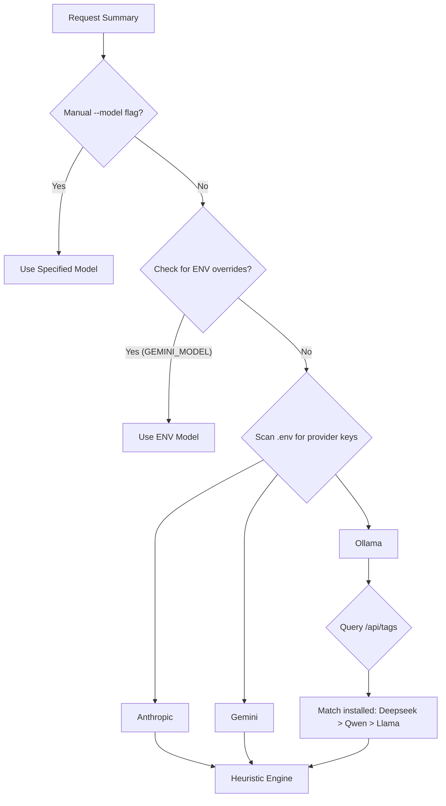
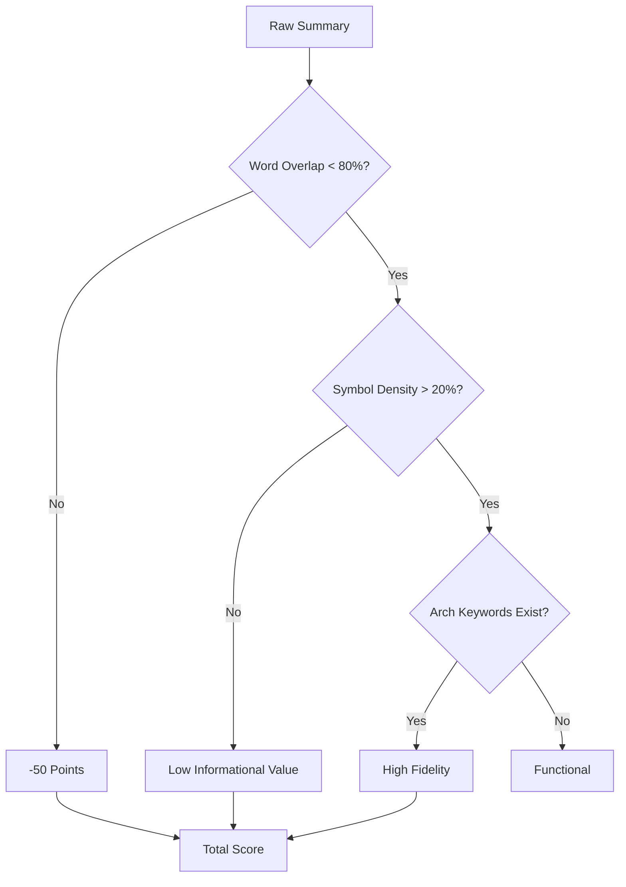

# System Decision Trees & Execution Paths

This document outlines the logical flow of Repo Rosetta, focusing on how it selects analysis paths and handles failures.

## 1. LLM Provider & Model Selection
The system adapts to both remote APIs and local self-hosted models, prioritizing configured overrides.

## 2. Heuristic Role Classification
When LLMs are unavailable, the tool uses topological and naming cues to classify modules.

| Role | Criteria | Description |
|---|---|---|
| **CONTROLLER** | Path contains `api/` or Name includes `router` | External facing interface logic. |
| **DATA_MODEL** | Name includes [model](file:///c:/Users/najee/OneDrive/Documents/Projects/Repo%20Rosetta/backend/summarizer/engine.py#14-25) or `schema` | State and type definitions. |
| **CORE_ENGINE** | Out-Degree > 3 AND In-Degree > 3 | High-complexity orchestration nodes. |
| **UTILITY_LIB** | In-Degree > 5 | Reusable helper modules referenced by many. |
| **ISOLATED_SCRIPT** | Out-Degree = 0 AND In-Degree = 0 | Standalone tasks/tools. |
| **GENERAL_MODULE** | default | Standard domain logic. |

## 3. Quality Scoring (Fidelity Audit)
Every summary (LLM or Heuristic) is audited before being committed to the report.

## 4. CLI Execution Flow
The overall sequence from user command to final Markdown file.

1.  **Parse CLI Args**: Identify path, persona, and verbosity.
2.  **Crawl Files**: Use Tree-sitter to index functions, classes, and imports.
3.  **Build Graph**: Map dependencies between modules.
4.  **Analyze Nodes**:
    *   Find children (classes/functions).
    *   Calculate connectivity (In/Out degrees).
    *   Classify Role.
5.  **Generate Summary**: Execute the LLM Selection tree.
6.  **Audit Quality**: Run the scoring engine.
7.  **Render Markdown**: Generate Mermaid diagram and Module Reference table.
