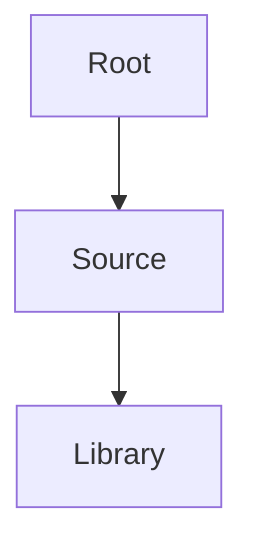

# CODEBASE.md - Repo Rosetta

## Overview
This is a generated architecture guide for the repository.

## Configuration
- **Generated on**: 2026-03-16 16:14:31
- **Persona**: pm
- **Verbosity**: brief

## Architecture Map

## Module Reference
| Module | Description |
|---|---|
| src/ | Core logic |
| docs/ | Documentation |

Generated by Repo Rosetta.
