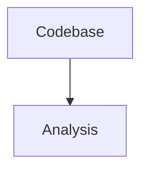

# CODEBASE.md - Repo Rosetta

## Overview
This is a high-fidelity architectural guide generated by Repo Rosetta.

## Configuration
- **Generated on**: 2026-03-16 20:44:05
- **Persona**: architect
- **Verbosity**: brief

## Architecture Map

## Module Reference
| Module | Description |
|---|---|
| dump_tree.py | `module` (module) serves as a strategic interface for system-wide operations. |
| read_log.py | `module` (module) serves as a strategic interface for system-wide operations. |
| repro_ts.py | `module` (module) serves as a strategic interface for system-wide operations. |
| backend/main.py | `module` (module) serves as a strategic interface for system-wide operations. |
| backend/models.py | `module` (module) serves as a strategic interface for system-wide operations. |
| backend/__init__.py | `module` (module) serves as a strategic interface for system-wide operations. |
| backend/api/chat.py | `module` (module) serves as a strategic interface for system-wide operations. |
| backend/api/lsp_proxy.py | `module` (module) serves as a strategic interface for system-wide operations. |
| backend/api/router.py | `module` (module) serves as a strategic interface for system-wide operations. |
| backend/auth/github.py | `module` (module) serves as a strategic interface for system-wide operations. |

Generated by Repo Rosetta.
